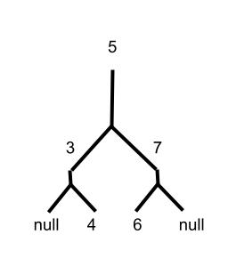

## Introduction

Trees are unlike any of the other data structures we’ve covered. Most other data structures are linear, and the program goes up and down them looking for data. With a tree, the program can go down many branching paths. This complicates things in execution, but lets us do some impressive things to reduce the amount of processing power our programs need to run. 

## Nodes and Inserting Values

Trees work off a system of nodes. This first node is always referred to as the “root”. You can think of it as the roots or trunk of the tree. Then more and more nodes are attached to the tree as the data structure is filled with information. 

Where the genius of a tree structure lies in how the items are added. Imagine the tree as upside down. The first bit of data is the number 5. The tree stores this at the root. 

Now, if we add a 3 the tree places that on the left branch. This is because it is less than 5. Next comes a 7. This goes on the opposite side, because it's greater than 5. 

Finally, we get to the interesting part. Two numbers come down the line, 4 and 6. 4 gets sent down the left branch where it encounters 3. 4 is greater than 3, so it then moves to the right side of the left branch. The opposite happens to 6. It moves down the right branch, then gets shifted left when it encounters the 7.

Sorting the items like this gives the code a good chance of finding the right value, because it can disregard certain branches if they are too low or too high to contain the desired value. 

This makes a tree O(1) in some scenarios, but if we are unlucky it can slow down. The worst case scenario for a tree is O(n) operation. 
Traversal

To search the tree, we start at the root then generally check the left value first. If the first node is a lower value than what we are looking for, we can give up on that branch entirely and search the right branch. We keep crossing out parts of the tree using these greater/less than arguments until we arrive at our destination, or search the entire tree without finding it. 

## Example

## Problem to Solve

Get a friend or fellow classmate to help you. Grab 3 index cards. On one of them, sketch a tree structure like in the example. Then have your partner fill out the tree with values. Then use the two remaining index cards to hide all the values on the tree except the root. Traverse the tree using greater than or less than logic, and trying to find specific data on the tree. 

After you have found a few data points, write up a new tree and let your partner find the data. 
